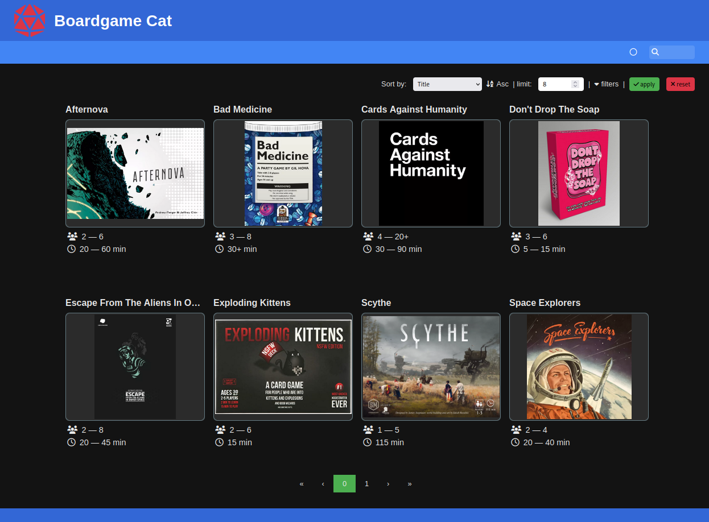

:doctype: book
:toc: macro
:toc-title:
:toclevels: 3
:sectnums:
:sectnumlevels: 1

ifdef::env-github[]
++++

    This is a mirror! Go to the official repository on <a href="https://gitlab.com/imstevenxyz/bgcat" ref="nofollow">Gitlab</a>

  

  <strong>BGCat</strong>

  BGCat, short for Boardgame Catalog, is a web app for displaying your magnificent boardgame collection to your friends. With the search and filter features you and your friends can effortlessly find the game to play!

    <a href="#Installation"><strong>Get Started</strong></a> • <a href="https://bgcat.imsteven.xyz/" rel="nofollow"><strong>Demo</strong></a> • <a href="https://bgcat.imsteven.xyz/api/v1/docs/" rel="nofollow"><strong>API Docs</strong></a>

  

++++
endif::[]

ifndef::env-github[]

[.text-center]
[.big]#*BGCat*#

[.text-center]
BGCat, short for Boardgame Catalog, is a web app for displaying your magnificent boardgame collection to your friends. With the search and filter features you and your friends can effortlessly find the game to play!

[.text-center]
link:#Installation[*Get Started*] • link:https://bgcat.imsteven.xyz/[*Demo*] • link:https://bgcat.imsteven.xyz/api/v1/docs/[*API Docs*]

endif::[]

toc::[]

== Installation

=== Manual

1. Install link:https://surrealdb.com/install[SurrealDB]
2. Install BGCat
.. link:https://gitlab.com/imstevenxyz/bgcat/-/packages[Download] the latest release and unpack in a directory of your choosing
.. Configure BGCat, see link:#Configuration[below]
3. Run the `bgcat` binary, eg: `./bgcat`

=== Container

Supported architectures:

* linux/amd64
* linux/arm64

[source, bash]
----
docker run --detach --restart=always \
    -e BGCAT_ADMIN_TOKEN="a_good_password" \
    -e BGCAT_SECRET="super_secret_cookie_that_should_be_really_long" \
    -p 8000:8000 \
    -v </your/local/data>:/app/data \
    registry.imsteven.xyz/lib/bgcat:latest
----

By default the container will run with user uid and gid 65534 (nobody). Running with an arbritrary id is possible using `--user {uid}:{gid}`. Make sure this matches the ownership of your local data directory.

The images include a local installation of SurrealDB. To use this instance don't change the db_start_local and db_cmd configuration options!

=== Helm

TODO

=== Build manually

1. Install link:https://doc.rust-lang.org/cargo/getting-started/installation.html[Rust]
2. Download this repo
3. Build BGCat for your native architecture:
+
[source, bash]
----
cargo build --release
----
4. Run the build binary:
+
[source, bash]
----
./target/release/bgcat
----

== Configuration

BGCat can be configured using a config file (`bgcat.toml`) or environment variables.
Environment variables should be all uppercase and prefixed with `BGCAT_`, eg: `BGCAT_ADMIN_TOKEN`

Possible options:
[grid:"rows", format="csv"]
[options:"header"]
|===
Option, Description, Type, Default

admin_token, The token for the admin interface, string `required`,
secret, Secret token used for session cookie, string `required`,
adr, Address to listen on, string, `0.0.0.0`
port, Port to listen on, u16, `8000`
data_dir, The directory to store the assets and db file if applicable, string, `./data`
webp_quality, The encoding quality to use when converting uploaded images, f32, `0.50`
default_page_limit, The default limit of items to show per page, u32, `8`
ui_page_limit_step, Step interval of the page limit input field, u32, `4`
db_start_local, Wether to start a local SurrealDB instance, bool, `true`
db_cmd, SurrealDB command to start local instance, string, `surreal`
db_adr, The address of the database, string, `ws://localhost:8001`
db_ns, Database namespace, string, `bgcat`
db_name, Database name, string, `bgcat`
db_user, Database authentication username, string, `root`
db_pass, Database authentication password, string, `root`
log_level, The log level to show in console, "string (`error`, `warn`, `info`, `debug`)", `info`
|===

== Usage

=== Admin web interface

The interface is available at the `/admin` endpoint, eg: `localhost:8000/admin`.

Here you can create, delete and update your boardgames. Uploaded images are converted to webp and stored in the `assets` folder under your data directory.

=== Rest API

Swagger interface is available at `/api/v1/docs/`. +
The openapi specification is available at `/api/v1/openapi.json`

== Acknowledgment

Inspirations for theme and colors:

* link:https://github.com/bastienwirtz/homer[bastienwirtz/homer] (Header and light/dark theme)
* link:https://github.com/catppuccin/catppuccin[catppuccin/catppuccin] (Colors)